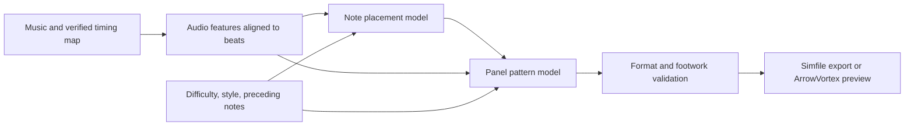

Research assessment — local AI generation of ITG simfiles

Investigated on September 16, 2026. Scope: feasibility, model selection, training data, evaluation, and eventual
ArrowVortex integration. No real checkpoint fine-tuning or inference-quality benchmark was performed. The workstation
has no NVIDIA GPU; synthetic CPU checks validate the environment only. Corpus size and preferred chart style remain
unspecified; recommendations assume four-panel dance-single and an initial narrow style/difficulty range.

**The proposed product is feasible as a chart-drafting assistant. The selected experiment is Qwen3-1.7B LoRA, starting
with a CPU development environment.** A model already trained for dance charts provides a useful comparison baseline.
Good human mapping depends on musical choices, physical movement, and consistency over a song. Generating valid simfile
text is only one small part of the problem. Expert-quality charts across arbitrary styles remain an experimental
objective.

The editor appears to be ArrowVortex, and ITG is In The Groove. The relevant upstream repository is
[uvcat7/ArrowVortex](https://github.com/uvcat7/ArrowVortex). Its current source supports Windows, CMake/vcpkg builds,
`.sm`/`.ssc`, BPM/offset detection, stream generation, and undo/redo. Source inspection used commit
`5ebb8283bba5ee308713967ca9455f8b40fed9d4`.

The supplied [WeChat article](https://mp.weixin.qq.com/s/e2m2QB3IWYXCxg5gcmR3aw) redirected to an
environment-verification page. The subsequently supplied
[source repository](https://github.com/junqiangchen/qwen3_Lora_sft_medicalQA/tree/2906f6a68fb2e4f5048f08433853f1fbc6f49b60)
resolves the intended model as **Qwen3-1.7B**, with standard PEFT LoRA and Transformers Trainer. See
[the source review](tutorial-reference.md) for dependencies and implementation limitations. The earlier “Qwen3.7 7B”
name was a naming ambiguity, not the checkpoint selected by this code.

**Qwen can contribute, but the exact checkpoint and input modality matter.**

| Candidate                  | Verified capability                                                                                   | Assessment for this project                                                                                              |
| -------------------------- | ----------------------------------------------------------------------------------------------------- | ------------------------------------------------------------------------------------------------------------------------ |
| Qwen3-1.7B                 | Downloadable 1.7B text-generation checkpoint used by the supplied tutorial.                           | Selected for the first LoRA experiment. Needs a separate audio frontend for music-to-chart generation.                   |
| Qwen3.7-Max / Qwen3.7-Plus | Official API catalog lists Max as text input and Plus as text/image/video input; neither lists audio. | Not a verified foundation for local music-to-chart fine-tuning. I did not locate official downloadable 3.7 weights.      |
| Qwen3-4B-Instruct-2507     | Downloadable 4B text-generation checkpoint; non-thinking output.                                      | A manageable comparison model for symbolic rhythm-to-pattern learning. Needs a separate audio frontend.                  |
| Qwen2.5-Omni-7B            | Downloadable model accepting audio and producing text.                                                | A plausible direct audio-to-chart-token fine-tuning experiment, with substantially more audio/training integration work. |
| Qwen3-Omni-30B-A3B         | Downloadable model accepting audio, among other modalities.                                           | A larger research candidate; active parameter count does not represent total weight-storage requirements.                |
| ITGPT                      | Specialized audio-to-DDR/ITG chart project with training and generation code.                         | First baseline to evaluate and adapt.                                                                                    |

Sources: [Qwen3-1.7B model card](https://huggingface.co/Qwen/Qwen3-1.7B),
[Qwen API catalog](https://qwen.ai/apiplatform),
[Qwen3-4B model card](https://huggingface.co/Qwen/Qwen3-4B-Instruct-2507),
[Qwen2.5-Omni-7B model card](https://huggingface.co/Qwen/Qwen2.5-Omni-7B),
[Qwen3-Omni repository](https://github.com/QwenLM/Qwen3-Omni), and
[ITGPT repository](https://github.com/miguelomalley/ITGPT). A direct query of the official Qwen Hugging Face catalog
returned no repositories matching `Qwen3.7`; that is a bounded search result, not proof that no release exists anywhere.

Ordinary supervised fine-tuning teaches a model to predict targets from the inputs supplied to it. LoRA trains a small
set of added parameters; QLoRA additionally quantizes the frozen base weights. Neither method gives a text model an
audio encoder. Pairing `song.mp3` as a filename with chart text cannot teach musical alignment to a model that never
receives the decoded audio or informative audio features.

There are three meaningful experiments:

1. Adapt a specialized chart model using aligned audio and note targets.
2. Fine-tune a text Qwen model on structured rhythm events, difficulty/style controls, preceding notes, and available
   musical features, predicting panel patterns. Its ceiling depends partly on what the audio frontend preserves.
3. Fine-tune an audio-capable Omni model on audio excerpts and structured chart targets. Whether its audio
   representation preserves the timing precision needed here must be measured.

Adding a learned audio encoder/projector to text Qwen is also possible, but requires multimodal alignment training and
custom model integration. Serializing a long spectrogram as decimal text is an inefficient substitute. General
music-description ability does not establish reliable note timing or playable foot patterns.

Qwen's documentation provides a LoRA example for Qwen3-8B using 22 GB GPU memory at a 2,048-token maximum length. That
is evidence that local adaptation is possible, not a memory guarantee for chart or audio workloads.
[Official training example](https://github.com/QwenLM/Qwen3/blob/main/docs/source/training/ms_swift.md). For Omni,
ms-swift documents training the Thinker component and disabling audio output to reduce memory; speech synthesis is
unnecessary for chart generation.
[ms-swift parameters](https://swift.readthedocs.io/en/latest/Instruction/Command-line-parameters.html#qwen2-5-omni-qwen3-omni).

**There is already research that directly addresses the goal.**

ITGPT was published in July 2026. Its paper uses 253 songs and 952 charts from one author, combining beat-aligned
placement with audio-conditioned step selection. It reports onset F1 of 0.7801 versus 0.7033 for DDCL in its comparison.
Those are author-reported reconstruction metrics, not evidence of expert approval. Its note vocabulary covers taps and
holds, excluding mines and rolls. [ITGPT paper](https://arxiv.org/html/2607.14148v1).

The [checkpoint repository](https://huggingface.co/miguelomalley/ITGPT/tree/main) contains `onset_paper.pt`,
`sym_paper.pt`, `onset_stamina.pt`, and `sym_stamina.pt`. The listed paper pair totals approximately 311 MB and the
stamina pair approximately 340 MB. These are download sizes, not GPU-memory estimates. Checkpoint compatibility and the
provenance of the stamina variant need verification before interpreting results.

I inspected ITGPT commit `81de0bfebe02d7aba722ddcb3b417e3a94b89d7c`. The importer searches for `.sm`, substitutes mines
with empty cells, and substitutes rolls with holds. Supporting `.ssc` or retaining those note types requires an explicit
adaptation.
[Importer source](https://github.com/miguelomalley/ITGPT/blob/81de0bfebe02d7aba722ddcb3b417e3a94b89d7c/smfiler.py). The
generation entry point defaults to the stamina checkpoints and a BPM search range of 100–200; those defaults should be
reviewed for the target songs.
[Generation source](https://github.com/miguelomalley/ITGPT/blob/81de0bfebe02d7aba722ddcb3b417e3a94b89d7c/generate_charts.py).

Earlier work supplies useful alternative baselines. Dance Dance Convolution separates placement and selection; its
original demo is tempo-agnostic, making it a historical reference rather than the preferred editor integration.
[DDC project](https://ddc.chrisdonahue.com/). Dance Dance ConvLSTM adds beat alignment and audio features to selection.
[DDCL paper](https://arxiv.org/abs/2507.01644). The beat-aligned Transformer/GOCT work shows useful sequence
representations and transfer learning, but its main corpus is osu!mania; keyboard patterns do not establish pad
playability. [GOCT paper](https://stet-stet.github.io/goct/demo/GOCT.pdf).

**Use an explicit timing and note representation throughout training and generation.**

This is a proposed architecture. Either ITGPT or an experimental Qwen decoder can occupy the relevant model stages. A
whole-song plan should guide density, rests, and repeated sections; phrase generation should carry note history, active
holds, and plausible foot state across boundaries. An 8–16-measure window is a reasonable initial experiment, not an
established optimum.

Training examples should contain the exact audio version, timing map, chart identity, target difficulty/style, and note
events. An internal event might be `{beat_numerator: 17, beat_denominator: 4, panels: [1,0,0,0]}`: this denotes a
left-panel tap at beat 4.25, with columns ordered left/down/up/right. Rational beats or integer ticks prevent
accumulated decimal drift. This schema is illustrative, not a required model tokenizer.

Have ordinary code serialize the validated events to `.sm`/`.ssc`. For Qwen experiments, use a compact fixed schema and
train output-only prediction; a custom event vocabulary may improve efficiency later. If new tokens are added, their
embeddings and output weights need training too. Fine-tuning only existing attention adapters does not train newly
initialized token rows automatically.

A correct timing map is foundational. At constant BPM without stops or warps, the StepMania convention gives
`audio_seconds = 60 * beat / BPM - OFFSET`. The inspected ArrowVortex code uses 48 rows per beat and starts timing at
negative offset. Variable BPMs, stops, delays, and warps require a timing engine; SSC can override timing per chart.
[Tempo definitions](https://github.com/uvcat7/ArrowVortex/blob/5ebb8283bba5ee308713967ca9455f8b40fed9d4/src/Simfile/Tempo.h),
[timing implementation](https://github.com/uvcat7/ArrowVortex/blob/5ebb8283bba5ee308713967ca9455f8b40fed9d4/src/Simfile/TimingData.cpp),
[simfile documentation](https://simfile.readthedocs.io/).

Initially use human-verified timing for generation as well as training. Then evaluate automatic timing separately.
Matching the training-time BPM detector does not ensure correct synchronization on new songs. Keep the target engine's
sync convention consistent; the simfile library documents a 9 ms distinction between ITG and null sync. Do not blindly
shift a mixed corpus. [Sync example](https://simfile.readthedocs.io/en/v3/examples.html).

**Corpus preparation is likely to matter more than choosing a larger language model.**

Use pad charts from the intended community/style. Stamina, technical, and beginner mapping have different distributions
of density, repetition, movement, and rests. Keep those distinctions as labels or separate initial experiments. Existing
simfiles provide panel events, not definitive left/right-foot annotations; inferred footing should carry uncertainty.

Audit audio matches, chart timing, missing files, malformed holds, duplicates, note types, meter conventions, and
author/pack identity. Deduplicate both charts and audio, including copies across packs. Split by song/audio identity
before producing excerpts, mirrors, rate variants, or multiple difficulty examples. Holding out windows from a song
while training on its neighboring windows gives a misleading generalization result. Add a held-out pack or author
evaluation if the product should generalize across mapping styles.

As a planning target, begin with roughly 100–300 carefully checked songs in a narrow style to validate the pipeline.
This is an engineering estimate, not a sufficiency claim. More independent songs and styles should follow if learning
curves and player reviews justify expansion. Count independent songs separately from charts and augmented excerpts.

Use the same preprocessing at inference. Time stretching requires corresponding timing adjustments; lane transforms must
preserve the intended style. Balance easy and hard examples so the model does not learn that every song should become
dense stream. Control both nominal meter and measurable density/strain, since meters vary across corpora.

**Playable output needs validation beyond file syntax.**

Hard validation should reject invalid lanes, illegal hold transitions, conflicting events, and events outside the
supported time range. Playability checks should consider possible foot assignments, active holds, movement distance
versus available time, awkward boundary transitions, and style-dependent doublesteps, crossovers, jacks, brackets, or
spins. These features are not universally errors. Use configurable constraints or candidate ranking instead of erasing
all technical content.

GrooveAuthor already documents controls for footing, movement, transitions, and pattern boundaries. Its chart generation
derives from existing charts, so it is a useful footwork reference rather than a replacement for learning placement from
music.
[Autogen documentation](https://github.com/PerryAsleep/GrooveAuthor/blob/main/StepManiaEditor/docs/AutogenConfigs.md).

Compare models on identical held-out songs, verified timing, difficulty controls, and validators:

| Question                               | Measurement                                                                                         |
| -------------------------------------- | --------------------------------------------------------------------------------------------------- |
| Does it emit usable files?             | Parse/serialize round trips; zero invalid hold transitions in accepted output.                      |
| Does it follow the music?              | Placement precision/recall at declared tolerances, timing-offset diagnostics, and listening review. |
| Is it playable at the requested level? | Footwork/strain diagnostics and actual pad playtests.                                               |
| Does it map musically over a song?     | Phrase/repetition/rest review and blinded preference judgments by experienced charters.             |
| Is it useful in the editor?            | Editing time to an acceptable chart, amount regenerated, latency, and peak memory.                  |

Reference note agreement is a reconstruction metric: many different panel choices can be good. Report teacher-forced
accuracy separately from full autoregressive generation. Evaluate placement with reference patterns and pattern
generation with reference rhythms to locate failures, then evaluate the full pipeline. Include an audio-shuffle ablation
to determine whether a candidate actually uses music rather than relying only on difficulty and note history.

Supervised adaptation should come first. Later, accepted edits and ranked candidates can support preference learning,
provided preference pairs share the same music and intended style/difficulty. Simple rewards such as density matching or
constant foot alternation can be maximized by dull charts, so reinforcement learning is not the first milestone.

**ArrowVortex can integrate a separate local inference process.**

A Python service can own decoding, features, model loading, generation, and validation. The C++ editor submits the
music, timing, selected range, controls, and surrounding notes, then previews the returned events. Apply an accepted
result as one undoable edit. Start the service once and retain loaded weights; use asynchronous jobs, cancellation, and
progress reporting.

The inspected source provides concrete integration points: `TimingData::beatToTime`/`timeToBeat`,
`NotesMan::modify(const NoteEdit&, ...)`, and history chains. The existing stream generator provides a reference for
inserting generated notes, while Dancing Bot supplies a footing heuristic to inspect rather than a complete playability
oracle.
[Timing interface](https://github.com/uvcat7/ArrowVortex/blob/5ebb8283bba5ee308713967ca9455f8b40fed9d4/src/Simfile/TimingData.h),
[note manager](https://github.com/uvcat7/ArrowVortex/blob/5ebb8283bba5ee308713967ca9455f8b40fed9d4/src/Managers/NoteMan.h),
[history](https://github.com/uvcat7/ArrowVortex/blob/5ebb8283bba5ee308713967ca9455f8b40fed9d4/src/Editor/History.h).

Before modifying the editor, generate ordinary simfiles and open them in ArrowVortex. This tests the output quality
using the desired workflow immediately. A later selected-region regeneration feature should condition on both preceding
and following notes. Generated responses should carry the originating chart revision so an old request cannot overwrite
subsequent edits.

For resource planning, measure ITGPT inference first on available hardware. A 4B text model has a theoretical weight
payload of about 8 GB at 16-bit precision or 2 GB at 4-bit precision; actual serving and training use more memory for
quantization metadata, activations, caches, adapters, and optimizer state. Audio context raises those costs further. No
training duration, purchase recommendation, or GPU fit can be established without the actual GPU and chosen
batch/context sizes.

After the environment setup, the selected next experiment is to audit a small target-style corpus, reserve unseen songs,
and adapt Qwen3-1.7B as a symbolic rhythm-to-panel decoder. Compare it with the published ITGPT checkpoints using blind
reviews and editing time. Proceed to an Omni experiment if results indicate that additional audio understanding could
address a measured weakness. Build the ArrowVortex UI after the generation pipeline can produce useful standalone
simfiles.
