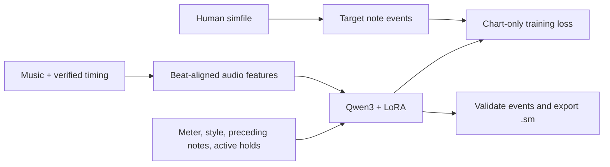

# Training Qwen to map musical rhythm to ITG notes

`your_training_script.py` was a placeholder. The runnable replacement is `train_itg.py`, with `prepare`, `train`,
`generate`, and `smoke-test` commands. This is an experimental baseline for your proposed music-to-chart workflow.

Qwen3-1.7B is a text model. We use a fixed audio frontend to turn the music into a short rhythm/energy description and
train Qwen to predict the human chart's note placements and panel patterns. LoRA changes the text model's behavior; it
does not train an audio encoder. This tests whether a compact description contains enough information to learn useful
mapping decisions. It is not yet a demonstrated expert-quality charter.



## Try the complete training path on this CPU machine

From the repository root:

```bash
nix develop
bash scripts/setup.sh cpu
uv run --no-sync python train_itg.py smoke-test --output outputs/my-smoke-test
```

The check creates two synthetic music/chart pairs, splits them by audio identity, constructs a tiny random Qwen3 and
local tokenizer, runs two LoRA optimizer steps, evaluates, saves the adapter/tokenizer, and verifies adapter reload. It
downloads no pretrained model. Its synthetic adapter is only for testing; it will not generate useful charts. Use a new
output directory for every run.

## Prepare your existing charts and music

Keep each simfile with its referenced music, for example:

```text
data/songs/My Pack/Song A/chart.sm
data/songs/My Pack/Song A/music.ogg
data/songs/My Pack/Song B/chart.ssc
data/songs/My Pack/Song B/music.ogg
```

Then run this CPU preprocessing step:

```bash
uv run --no-sync python train_itg.py prepare \
  --songs data/songs \
  --output data/processed \
  --style stamina \
  --validation-fraction 0.1
```

Choose a style label that describes the corpus; `--style` applies to every chart in this run. Use a narrow style for the
first experiment, or `mixed` for a mixed corpus. The script does not infer style or foot assignments. Difficulty comes
from each chart's meter. Review `data/processed/report.json` for rejected charts before training.

The output is `train.jsonl`, `validation.jsonl`, and a preparation report. It requires at least two distinct songs,
although two songs are far too few to judge useful learning. All difficulties and excerpts with identical decoded mono
audio stay in one split; exact chart/audio duplicates are removed. Different lossy encodings, alternate edits, and
near-duplicates can evade this hash, so audit the split manually. Hold out additional songs for final testing.

Supported inputs are four-panel `dance-single` SM/SSC charts, positive BPMs and BPM changes, normal offsets, taps,
holds, rolls, and mines. SSC chart timing is resolved by the simfile library. This version rejects stops, delays, warps,
fake regions, unsupported note symbols, non-4/4 time signatures, and notes off the 1/48-beat grid. It reports these
exclusions instead of silently changing the chart. The first BPM must be at beat zero.

Check timing in the intended engine before preparation. The mapping uses the supplied StepMania offset directly: at
constant BPM, `audio_seconds = beat * 60 / BPM - OFFSET`. There is no automatic 9 ms sync adjustment or beat detection.
Notes more than 50 ms before audio start, or at/after audio end, cause the chart to be rejected.

## What one training example means

Each example covers eight beats (two ordinary measures), including rests. Its input contains:

- Onset strength, spectral loudness, bass energy, and treble energy from the actual music. These are sampled in 12 bins
  per beat and independently quantized to 0–15 using each song's 95th-percentile channel values. Four hex digits encode
  each bin compactly. Features use a centered 1,024-sample STFT at 22,050 Hz with a 220-sample hop.
- Local BPM changes, the position in the song, requested meter, and the supplied style label.
- The preceding four beats of notes and the holds/rolls active at the window boundary.

The answer is a sparse JSON list, for example:

```json
[
  [0, "1000"],
  [24, "0100"],
  [48, "0011"],
  [96, "2000"],
  [168, "3000"]
]
```

Ticks are relative to the window start, with 48 ticks per beat. Thus tick 24 is half a beat and tick 48 is one beat.
Columns are left/down/up/right. The example contains taps, a jump, and a left-panel hold. Symbols are `0` empty, `1`
tap, `2` hold head, `3` hold/roll tail, `4` roll head, and `M` mine. Empty rows are omitted; `[]` means a rest
throughout the window. Holds crossing windows are carried explicitly in the input state.

The target timestamps are taken from the human chart, never supplied as the current window's input. Music features and
timing describe the input rhythm; the model learns both which moments to chart and how to assign panels. Training uses
the actual preceding human notes; generation uses preceding generated notes, so errors can accumulate.

The loss covers only answer tokens and their end-of-message token. Input and padding labels are masked with `-100`.
Qwen's chat template is used with thinking disabled at both training and generation. Oversized examples fail with their
required token count; the script never silently truncates a target or cuts a hold tail.

## Train the actual Qwen3-1.7B adapter later

On a suitable NVIDIA machine, enter the Nix shell and install the CUDA extra. Transfer the prepared JSONL files and use
[configs/train.yaml](../configs/train.yaml):

```bash
bash scripts/setup.sh cuda
uv run --no-sync python train_itg.py train --config configs/train.yaml
```

This command downloads the pinned base checkpoint if it is not cached, then starts real training. The default config
requires CUDA. You can deliberately set `device: cpu` for real CPU training, but the smoke test is the practical
development path on this workstation. No GPU memory fit or training duration has been measured.

The configuration exposes learning rate, epochs, batch size, gradient accumulation, context length, checkpointing, and
LoRA settings. The initial learning rate is an experimental `2e-4`; tune it on held-out songs. Rank 8, alpha 16, dropout
0.05, and all four attention projections follow the tutorial's adapter settings. `load_in_4bit: true` enables optional
NF4 QLoRA on CUDA; the default is ordinary LoRA. This draft targets one training device.

Unlike the tutorial's partially wired YAML, these settings are passed to the trainer. Validation runs each epoch, the
checkpoint with the best validation loss is retained, and TensorBoard logs are saved. The output includes the adapter,
tokenizer, `run.json` with model revision/configuration/split identities, and intermediate checkpoints. Use a new
`output_dir` for each experiment; automatic resume is not implemented.

```bash
uv run --no-sync tensorboard --logdir outputs/qwen3-itg-lora/logs
```

Validation loss measures target prediction, not musical quality. Before trusting the model, generate held-out songs,
review timing and footwork, compare with human charts, and measure editing effort. Repeat generation with shuffled or
zeroed audio features to test whether the learned model is actually using the music; this evaluation is not yet
automated.

## Generate a standalone simfile

After real training, supply the same style label and a human-verified timing map. Example values below are placeholders
for the new song's actual BPM and offset:

```bash
uv run --no-sync python train_itg.py generate \
  --adapter outputs/qwen3-itg-lora \
  --music /path/to/new-song.ogg \
  --bpms '0=150' --offset -0.120 \
  --meter 10 --style stamina \
  --output outputs/generated-song --device cpu
```

For BPM changes use a string such as `--bpms '0=150,64=160'`. The command generates sequential eight-beat windows,
checks JSON, ticks, note symbols, and hold transitions, then writes `chart.sm`, `events.json`, and a copy of the music
to a new directory. Invalid output stops generation with the offending window; there is no hidden repair. CPU inference
loads the full model in FP32. CUDA inference uses BF16/FP16; the current generation command does not load quantized base
weights even when the adapter was trained with QLoRA.

Open the resulting song in ArrowVortex and review it. Structural validation does not guarantee pad playability:
brackets, foot assignments, strain, and movement across phrase boundaries still need dedicated validation. This frontend
summarizes attacks and energy but not harmony or long-term phrase structure. A learned audio encoder, longer musical
context, automatic timing, and editor integration are later experiments.

Implementation references: [Qwen3-1.7B model card](https://huggingface.co/Qwen/Qwen3-1.7B),
[Transformers Trainer](https://huggingface.co/docs/transformers/v4.57.1/en/main_classes/trainer),
[simfile source](https://github.com/garcia/simfile), and
[librosa STFT](https://librosa.org/doc/0.11.0/generated/librosa.stft.html).
